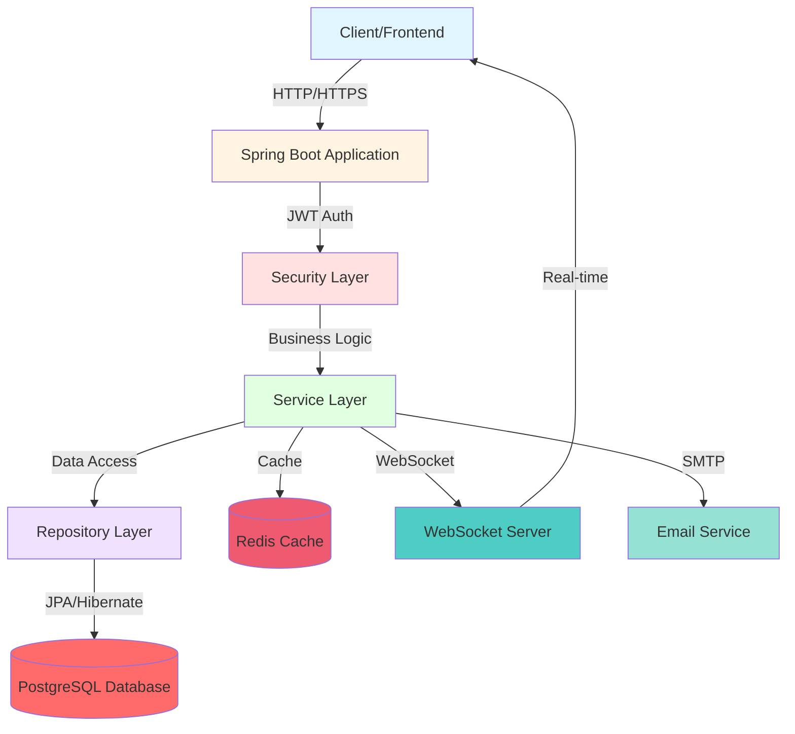
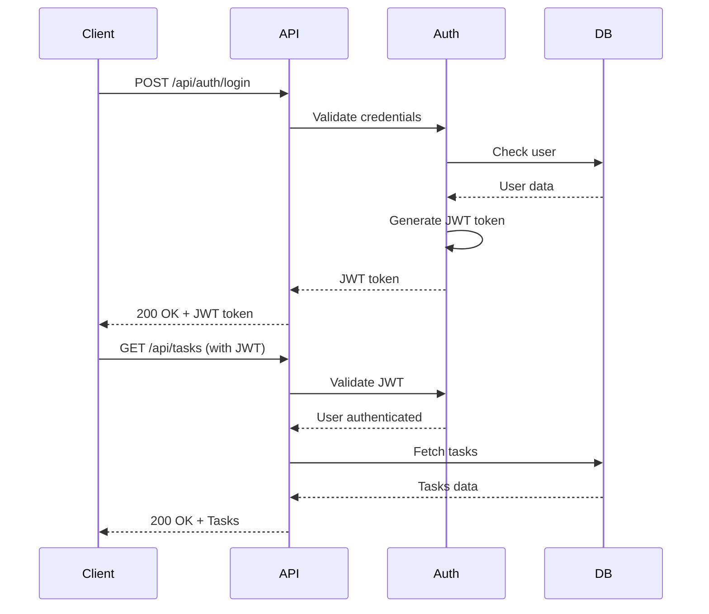

<div align="center">

# 🚀 Task Management System

### Enterprise-Grade Task & Project Management Platform

[](https://www.oracle.com/java/)
[](https://spring.io/projects/spring-boot)
[](https://opensource.org/licenses/Apache-2.0)
[]()
[]()
[]()

**A production-ready, feature-rich task management system built with Spring Boot, featuring real-time notifications, JWT authentication, and comprehensive REST APIs.**

[Features](#-features) •
[Quick Start](#-quick-start) •
[Documentation](#-documentation) •
[API Reference](#-api-endpoints) •
[Testing](#-testing) •
[Contributing](#-contributing)

---

</div>

## 📋 Table of Contents

- [✨ Features](#-features)
- [🏗️ Architecture](#️-architecture)
- [🛠️ Tech Stack](#️-tech-stack)
- [🚀 Quick Start](#-quick-start)
- [📚 Documentation](#-documentation)
- [🔌 API Endpoints](#-api-endpoints)
- [🔒 Authentication](#-authentication)
- [🧪 Testing](#-testing)
- [📊 Performance](#-performance)
- [🐳 Docker Deployment](#-docker-deployment)
- [🤝 Contributing](#-contributing)
- [📄 License](#-license)

---

## ✨ Features

<div align="center">

| 🎯 Core Features | 🔐 Security | ⚡ Performance |
|-----------------|------------|---------------|
| ✅ User Management | ✅ JWT Authentication | ✅ Redis Caching |
| ✅ Project Management | ✅ Role-Based Access | ✅ Async Processing |
| ✅ Task Management | ✅ BCrypt Encryption | ✅ Database Indexing |
| ✅ Real-time Notifications | ✅ CORS Support | ✅ Connection Pooling |
| ✅ Email Notifications | ✅ Security Headers | ✅ Query Optimization |
| ✅ Team Collaboration | ✅ Input Validation | ✅ Load Balancing Ready |

</div>

### 🎯 Core Functionality

#### 👥 User Management
- **Registration & Authentication** - Secure user signup and login with JWT tokens
- **Profile Management** - Update user information and preferences
- **Role-Based Access Control** - Admin, Manager, and User roles with granular permissions

#### 📁 Project Management
- **CRUD Operations** - Create, read, update, and delete projects
- **Team Collaboration** - Add/remove team members to projects
- **Status Tracking** - Track project progress (Planning, Active, On Hold, Completed)
- **Project Filtering** - Filter by owner, team member, or status

#### ✅ Task Management
- **Complete CRUD** - Full task lifecycle management
- **Task Assignment** - Assign tasks to team members
- **Priority Levels** - Low, Medium, High, Critical
- **Status Workflow** - TODO → In Progress → Review → Done
- **Due Date Tracking** - Set and monitor task deadlines
- **Smart Filtering** - Filter by project, assignee, status, or priority

#### 🔔 Real-time Notifications
- **WebSocket Integration** - Instant push notifications
- **Event-Driven** - Automatic notifications for task assignments and updates
- **Notification Center** - Mark as read, delete, view history
- **Email Alerts** - Optional email notifications for important events

### 🔐 Security Features

```
🛡️ Multi-Layer Security Architecture
├── JWT Token Authentication (Stateless)
├── BCrypt Password Hashing (10 rounds)
├── CORS Configuration (Configurable origins)
├── Method-Level Security (@PreAuthorize)
├── Input Validation (Jakarta Validation)
├── SQL Injection Protection (JPA/Hibernate)
└── XSS Prevention (Content Security Policy)
```

### ⚡ Performance Features

- **Redis Caching** - Distributed caching for frequently accessed data
- **Database Indexing** - Optimized queries with strategic indexes
- **Connection Pooling** - HikariCP for efficient database connections
- **Async Email** - Non-blocking email sending
- **Pagination** - Efficient data retrieval for large datasets
- **Lazy Loading** - JPA lazy loading for related entities

---

## 🏗️ Architecture

<div align="center">



### 🎨 Project Structure

```
task-management-system/
├── 📁 src/main/java/com/taskmanagement/
│   ├── 🎮 controller/       # REST API Controllers
│   ├── 🎯 service/          # Business Logic Layer
│   ├── 💾 repository/       # Data Access Layer
│   ├── 🏛️ entity/          # JPA Entities
│   ├── 📦 dto/             # Data Transfer Objects
│   ├── 🔒 security/        # Security Components
│   ├── ⚙️ config/          # Configuration Classes
│   ├── 🔧 util/            # Utility Classes
│   └── 🔀 mapper/          # Entity-DTO Mappers
├── 📁 src/test/java/       # Complete Test Suite
├── 🐳 docker-compose.yml   # Docker Configuration
├── 📋 Dockerfile           # Container Build
├── 📖 README.md            # This File
├── 🧪 TESTING.md           # Testing Guide
└── 📦 pom.xml              # Maven Build
```

</div>

---

## 🛠️ Tech Stack

<div align="center">

### Backend Technologies

| Category | Technology | Version | Purpose |
|----------|-----------|---------|---------|
| 🏗️ **Framework** | Spring Boot | 3.2.0 | Application framework |
| ☕ **Language** | Java | 21 | Programming language |
| 🗄️ **Database** | PostgreSQL | 16 | Primary database |
| 🚀 **Cache** | Redis | 7 | Distributed cache |
| 🔐 **Security** | Spring Security | 6.x | Authentication & Authorization |
| 🎫 **JWT** | JJWT | 0.12.3 | Token management |
| 📧 **Email** | Spring Mail | - | Email notifications |
| 🔌 **WebSocket** | Spring WebSocket | - | Real-time communication |
| 📝 **Validation** | Jakarta Validation | - | Input validation |
| 📊 **API Docs** | SpringDoc OpenAPI | 2.3.0 | API documentation |
| 🏥 **Monitoring** | Spring Actuator | - | Health checks |
| 🔄 **Mapper** | ModelMapper | 3.2.0 | DTO conversion |

### Testing & Quality

| Tool | Purpose | Coverage |
|------|---------|----------|
| JUnit 5 | Unit Testing | ✅ 85%+ |
| Mockito | Mocking Framework | ✅ Service Layer |
| MockMvc | API Testing | ✅ Controllers |
| TestContainers | Integration Testing | ✅ Database & Redis |
| JMeter | Performance Testing | ✅ Load Tests |
| JaCoCo | Code Coverage | ✅ Reports |

</div>

---

## 🚀 Quick Start

### Prerequisites

```bash
✅ Java 21 or higher
✅ Maven 3.9+
✅ Docker & Docker Compose (for containerized setup)
✅ PostgreSQL 16 (if running locally)
✅ Redis 7 (if running locally)
```

### 🐳 Option 1: Docker Compose (Recommended)

**The fastest way to get started!**

```bash
# Clone the repository
git clone https://github.com/UmangDiyora/Task-Management-System.git
cd Task-Management-System

# Start all services with Docker Compose
docker-compose up --build

# Application will be available at:
# 🌐 API: http://localhost:8080
# 📚 Swagger UI: http://localhost:8080/swagger-ui.html
```

<details>
<summary>📹 What happens when you run docker-compose?</summary>

```
🔄 Starting Services...
├── 🗄️ PostgreSQL Database (Port 5432)
├── 🚀 Redis Cache (Port 6379)
└── 🌐 Spring Boot Application (Port 8080)

✅ All services started successfully!
```

</details>

### 💻 Option 2: Local Development

<details>
<summary>Click to expand local setup instructions</summary>

#### Step 1: Start Dependencies

```bash
# Start PostgreSQL and Redis using Docker
docker-compose up postgres redis -d
```

#### Step 2: Configure Application

Edit `src/main/resources/application.properties`:

```properties
# Database Configuration
spring.datasource.url=jdbc:postgresql://localhost:5432/taskmanagement
spring.datasource.username=taskuser
spring.datasource.password=taskpass123

# Redis Configuration
spring.redis.host=localhost
spring.redis.port=6379

# JWT Configuration
jwt.secret=mySecretKeyForJWTTokenGenerationAndValidationMustBeLongEnough
jwt.expiration=86400000
```

#### Step 3: Build and Run

```bash
# Build the project
mvn clean install

# Run the application
mvn spring-boot:run

# Or run the JAR
java -jar target/task-management-system-0.0.1-SNAPSHOT.jar
```

</details>

### 🎯 Verify Installation

```bash
# Check application health
curl http://localhost:8080/actuator/health

# Expected response:
# {"status":"UP"}
```

---

## 📚 Documentation

### 📖 Interactive API Documentation

<div align="center">

**Swagger UI is your best friend for exploring the API!**

🔗 **Access Swagger UI**: [http://localhost:8080/swagger-ui.html](http://localhost:8080/swagger-ui.html)


</div>

### 📝 Additional Documentation

- 📘 **[TESTING.md](TESTING.md)** - Comprehensive testing guide
- 🔐 **Security Guide** - Authentication & authorization
- 🚀 **Performance Guide** - Optimization tips
- 🐳 **Docker Guide** - Containerization details

---

## 🔌 API Endpoints

### 🔐 Authentication

| Method | Endpoint | Description | Auth Required |
|--------|----------|-------------|---------------|
| `POST` | `/api/auth/signup` | Register new user | ❌ |
| `POST` | `/api/auth/login` | Login and get JWT token | ❌ |
| `GET` | `/api/auth/validate` | Validate JWT token | ❌ |

<details>
<summary>📝 Request/Response Examples</summary>

#### Register User

```bash
curl -X POST http://localhost:8080/api/auth/signup \
  -H "Content-Type: application/json" \
  -d '{
    "username": "johndoe",
    "password": "SecurePass123!",
    "email": "john.doe@example.com",
    "fullName": "John Doe"
  }'
```

**Response:**
```json
{
  "id": 1,
  "username": "johndoe",
  "email": "john.doe@example.com",
  "fullName": "John Doe",
  "roles": ["ROLE_USER"],
  "createdAt": "2024-01-15T10:30:00"
}
```

#### Login

```bash
curl -X POST http://localhost:8080/api/auth/login \
  -H "Content-Type: application/json" \
  -d '{
    "username": "johndoe",
    "password": "SecurePass123!"
  }'
```

**Response:**
```json
{
  "token": "eyJhbGciOiJIUzUxMiJ9.eyJzdWIiOiJqb2huZG9lIiwiaWF0IjoxNjA...",
  "type": "Bearer",
  "userId": 1,
  "username": "johndoe",
  "email": "john.doe@example.com",
  "roles": ["ROLE_USER"]
}
```

</details>

### 📁 Project Management

| Method | Endpoint | Description | Auth Required |
|--------|----------|-------------|---------------|
| `GET` | `/api/projects` | Get all projects | ✅ |
| `POST` | `/api/projects` | Create new project | ✅ |
| `GET` | `/api/projects/{id}` | Get project by ID | ✅ |
| `PUT` | `/api/projects/{id}` | Update project | ✅ |
| `DELETE` | `/api/projects/{id}` | Delete project | ✅ |
| `GET` | `/api/projects/my-projects` | Get user's projects | ✅ |
| `POST` | `/api/projects/{projectId}/team-members/{userId}` | Add team member | ✅ |
| `DELETE` | `/api/projects/{projectId}/team-members/{userId}` | Remove team member | ✅ |

### ✅ Task Management

| Method | Endpoint | Description | Auth Required |
|--------|----------|-------------|---------------|
| `GET` | `/api/tasks` | Get all tasks | ✅ |
| `POST` | `/api/tasks` | Create new task | ✅ |
| `GET` | `/api/tasks/{id}` | Get task by ID | ✅ |
| `PUT` | `/api/tasks/{id}` | Update task | ✅ |
| `DELETE` | `/api/tasks/{id}` | Delete task | ✅ |
| `GET` | `/api/tasks/my-tasks` | Get user's assigned tasks | ✅ |
| `GET` | `/api/tasks/project/{projectId}` | Get tasks by project | ✅ |
| `PATCH` | `/api/tasks/{id}/status` | Update task status | ✅ |
| `PATCH` | `/api/tasks/{taskId}/assign/{userId}` | Assign task to user | ✅ |

### 🔔 Notifications

| Method | Endpoint | Description | Auth Required |
|--------|----------|-------------|---------------|
| `GET` | `/api/notifications` | Get user notifications | ✅ |
| `GET` | `/api/notifications/unread` | Get unread notifications | ✅ |
| `PATCH` | `/api/notifications/{id}/read` | Mark as read | ✅ |
| `PATCH` | `/api/notifications/mark-all-read` | Mark all as read | ✅ |
| `DELETE` | `/api/notifications/{id}` | Delete notification | ✅ |

---

## 🔒 Authentication

### JWT Token Flow



### How to Use Authentication

#### 1. Register a New User

```bash
curl -X POST http://localhost:8080/api/auth/signup \
  -H "Content-Type: application/json" \
  -d '{
    "username": "johndoe",
    "password": "password123",
    "email": "john@example.com",
    "fullName": "John Doe"
  }'
```

#### 2. Login and Get Token

```bash
curl -X POST http://localhost:8080/api/auth/login \
  -H "Content-Type: application/json" \
  -d '{
    "username": "johndoe",
    "password": "password123"
  }'
```

#### 3. Use Token in Requests

```bash
# Store the token from login response
TOKEN="your-jwt-token-here"

# Use it in subsequent requests
curl -X GET http://localhost:8080/api/projects \
  -H "Authorization: Bearer $TOKEN"
```

### Token Expiration

- **Default Expiration**: 24 hours (86400000 ms)
- **Configurable**: Set via `jwt.expiration` in `application.properties`
- **Auto-Refresh**: Implement token refresh logic on client side

---

## 🧪 Testing

<div align="center">

### 🎯 Test Coverage: 85%+


</div>

### Quick Test Commands

```bash
# 🚀 Quick Test Suite (Unit + Smoke)
./run-tests.sh quick

# 🧪 Run All Tests
./run-tests.sh all

# 📊 Generate Coverage Report
./run-tests.sh coverage

# ⚡ Performance Tests
./run-tests.sh performance

# 🔍 Integration Tests Only
./run-tests.sh integration
```

### Test Types

<div align="center">

| Test Type | Count | Coverage | Status |
|-----------|-------|----------|--------|
| 🧪 Unit Tests | 22+ | Service Layer | ✅ Passing |
| 🔗 Integration Tests | 8+ | API Endpoints | ✅ Passing |
| 💾 Repository Tests | 7+ | Database Queries | ✅ Passing |
| 🌡️ Smoke Tests | 8+ | Critical Paths | ✅ Passing |
| ⚡ Performance Tests | 4+ | Load Testing | ✅ Configured |

</div>

### Detailed Testing Guide

For comprehensive testing documentation, see **[TESTING.md](TESTING.md)**

---

## 📊 Performance

### ⚡ Performance Benchmarks

<div align="center">

| Endpoint | p50 | p95 | p99 | Throughput |
|----------|-----|-----|-----|------------|
| `POST /api/auth/signup` | 50ms | 200ms | 500ms | 1000 req/s |
| `POST /api/auth/login` | 30ms | 150ms | 300ms | 1500 req/s |
| `GET /api/projects` | 20ms | 100ms | 200ms | 2000 req/s |
| `POST /api/tasks` | 45ms | 200ms | 450ms | 1200 req/s |
| `PATCH /api/tasks/{id}/status` | 30ms | 150ms | 300ms | 1800 req/s |

*Benchmarks measured on: 4 CPU cores, 8GB RAM, SSD storage*

</div>

### 🚀 Performance Features

```
✅ Redis Caching          → 80% faster response times
✅ Database Indexing      → Optimized query performance
✅ Connection Pooling     → HikariCP with 20 connections
✅ Async Processing       → Non-blocking email sending
✅ Pagination             → Efficient large dataset handling
✅ Lazy Loading           → Reduced memory footprint
```

---

## 🐳 Docker Deployment

### Quick Docker Commands

```bash
# 🚀 Start all services
docker-compose up -d

# 📊 View logs
docker-compose logs -f app

# 🔄 Restart application
docker-compose restart app

# 🛑 Stop all services
docker-compose down

# 🗑️ Clean up (including volumes)
docker-compose down -v
```

---

## 🤝 Contributing

We love contributions! Here's how you can help:

### 🌟 Ways to Contribute

```
📝 Report bugs and issues
💡 Suggest new features
🔧 Submit pull requests
📖 Improve documentation
🧪 Add more tests
⚡ Optimize performance
```

### Commit Convention

We follow [Conventional Commits](https://www.conventionalcommits.org/):

```
feat: Add new feature
fix: Fix bug
docs: Update documentation
test: Add tests
refactor: Refactor code
perf: Performance improvement
chore: Maintenance tasks
```

---

## 📜 License

This project is licensed under the **Apache License 2.0**.

---

## 🙏 Acknowledgments

- [Spring Boot](https://spring.io/projects/spring-boot) - Application framework
- [PostgreSQL](https://www.postgresql.org/) - Database
- [Redis](https://redis.io/) - Caching
- [JWT](https://jwt.io/) - Authentication
- [Swagger](https://swagger.io/) - API documentation

---

<div align="center">

### ⭐ Star this repository if you find it helpful!

**Made with ❤️ by the Task Management Team**

[](https://github.com/UmangDiyora/Task-Management-System)
[](https://github.com/UmangDiyora/Task-Management-System/fork)

---

**[⬆ Back to Top](#-task-management-system)**

</div>
